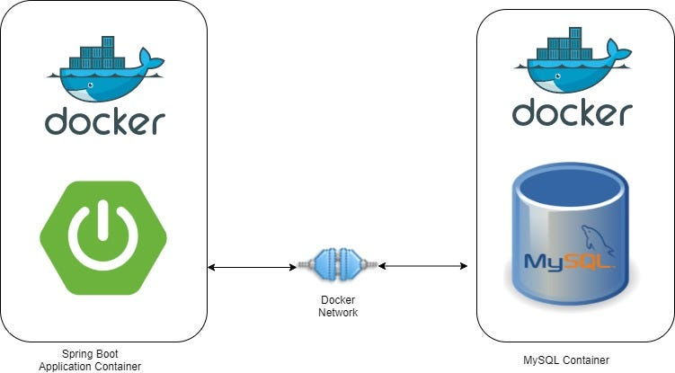
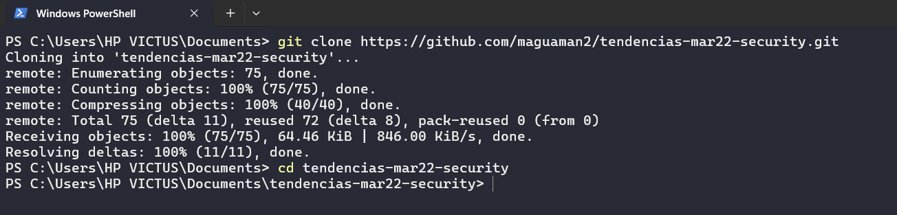
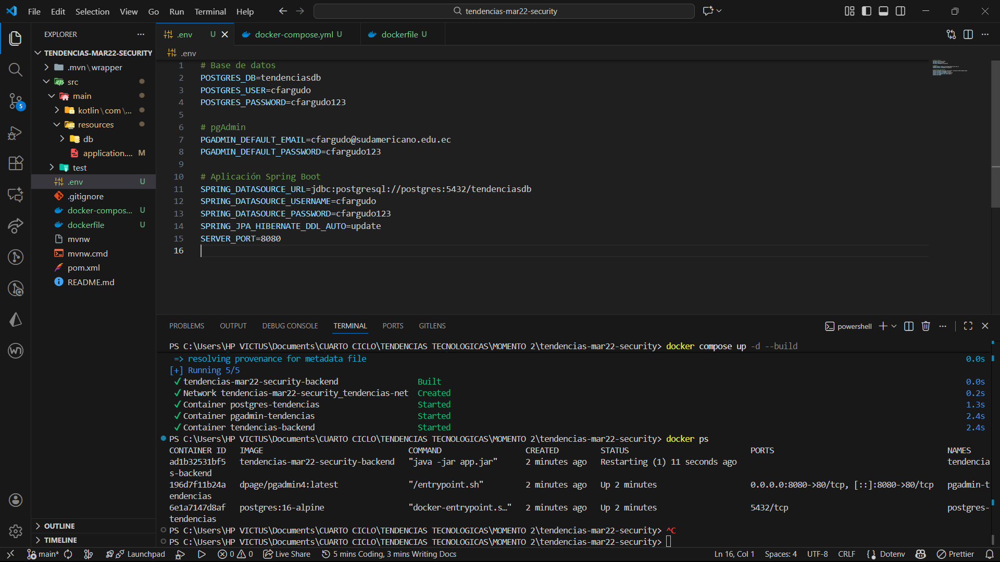
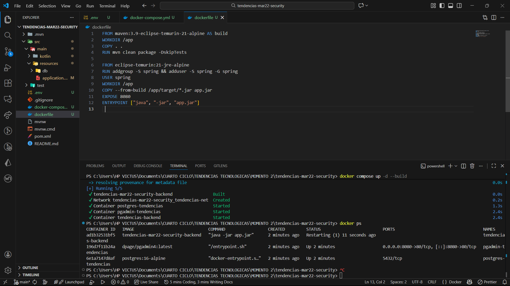
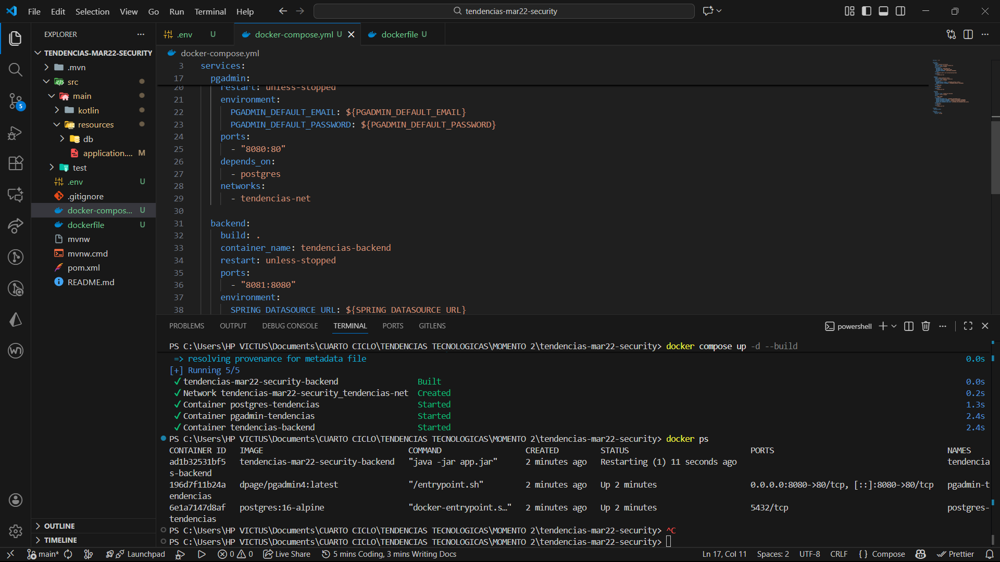
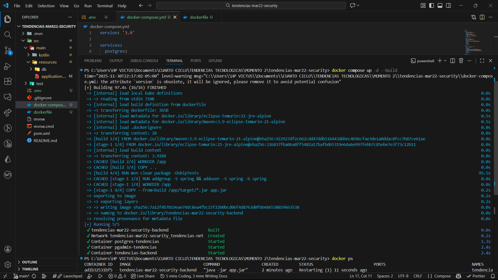
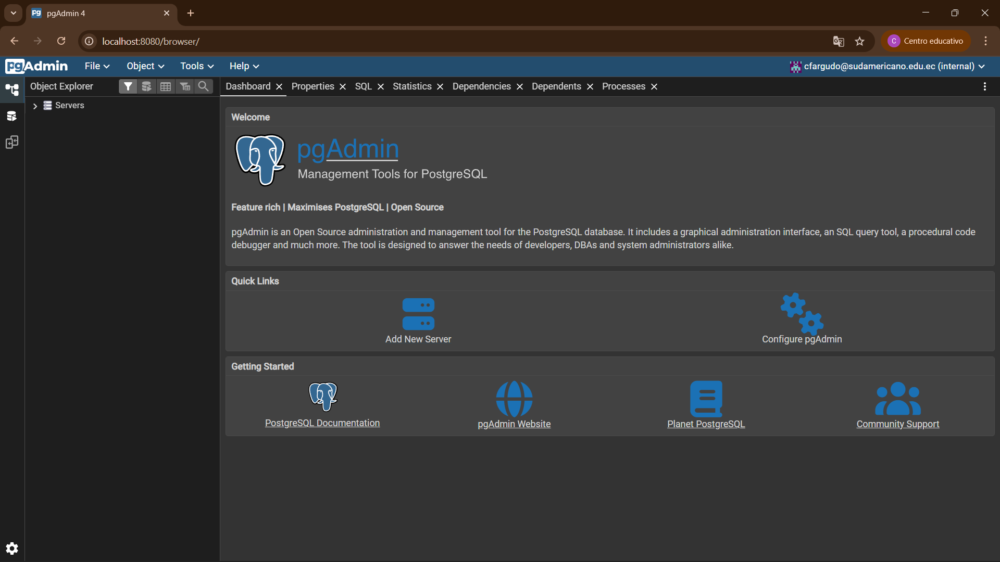

# **Implementación de una Arquitectura Dockerizada para una API Spring Boot con PostgreSQL y pgAdmin**

## **1. Título**

**Despliegue automatizado de una aplicación backend desarrollada en Spring Boot, integrada con PostgreSQL y administrada mediante pgAdmin, utilizando Docker y Docker Compose con una estrategia de construcción por etapas.**

## **2. Tiempo de duración**

**Tiempo estimado:** 2 horas (120 minutos)  

## **3. Fundamentos**

### **Spring Boot**

Spring Boot simplifica el desarrollo de APIs en Java al incluir herramientas que facilitan la seguridad, el manejo de dependencias, la persistencia de datos y la creación de servicios listos para producción.
La aplicación utilizada incorpora autenticación basada en JWT, gestión de usuarios y conexión a una base de datos relacional.

### **Multi-Stage Builds en Docker**

La técnica de multi-stage build permite separar el proceso de compilación del proceso final de ejecución.
Así, una imagen grande que contiene Maven y JDK se usa solo para construir la aplicación, mientras que la imagen final únicamente incluye lo necesario para ejecutarla, logrando:

- Menos peso
- Mayor seguridad
- Arranque más rápido

Este enfoque evita incluir herramientas innecesarias en la imagen final.

<p align="center">  </p>

## **4. Conocimientos previos**

- Poner en funcionamiento una API Spring Boot contenida en Docker
- Conceptos de redes, volúmenes y servicios en Docker Compose
- Uso básico de Maven
- Funcionamiento de Spring Boot y JPA
- Operaciones básicas en PostgreSQL
- Fundamentos del multi-stage build

## **5. Objetivos a alcanzar**

- Poner en funcionamiento una API Spring Boot contenida en Docker
- Crear servicios de PostgreSQL y pgAdmin conectados entre sí
- IUtilizar variables de entorno para separar configuraciones sensibles
- Construir una imagen optimizada mediante multi-etapas
- Organizar todos los servicios desde un solo archivo Compose
- Validar la operación completa del sistema mediante endpoints y accesos a pgAdmin

## **6. Equipo necesario**

- PC con Linux, Windows o macOS
- Docker Desktop actualizado
- TUn navegador web
- Acceso a terminal o consola
- Conexión estable a internet

## **7. Material de apoyo**

- Guías oficiales de Docker
- Documentación de Docker Compose
- Manual de Spring Boot (JPA y Data)
- Documentación de PostgreSQL y pgAdmin

## **8. Procedimiento**

### **Paso 1: Descarga del proyecto**

```bash
git clone https://github.com/maguaman2/tendencias-mar22-security.git
cd tendencias-mar22-security
```
<p align="center">  </p>

### Paso 2: Crear los archivos de configuración
Se crearon los siguientes archivos:

**1. .env**
```bash
# Base de datos
POSTGRES_DB=tendenciasdb
POSTGRES_USER=cfargudo
POSTGRES_PASSWORD=cfargudo123

# pgAdmin
PGADMIN_DEFAULT_EMAIL=cfargudo@sudamericano.edu.ec
PGADMIN_DEFAULT_PASSWORD=cfargudo123        

# Aplicación Spring Boot
SPRING_DATASOURCE_URL=jdbc:postgresql://postgres:5432/tendenciasdb
SPRING_DATASOURCE_USERNAME=cfargudo
SPRING_DATASOURCE_PASSWORD=cfargudo123
SPRING_JPA_HIBERNATE_DDL_AUTO=update
SERVER_PORT=8080
```
<p align="center">  </p>

**2. Dockerfile**

```bash
FROM maven:3.9-eclipse-temurin-21-alpine AS build
WORKDIR /app
COPY . .
RUN mvn clean package -DskipTests

FROM eclipse-temurin:21-jre-alpine
RUN addgroup -S spring && adduser -S spring -G spring
USER spring
WORKDIR /app
COPY --from=build /app/target/*.jar app.jar
EXPOSE 8080
ENTRYPOINT ["java", "-jar", "app.jar"]
```
<p align="center">  </p>

**3. docker-compose.yml**
``` bash 
version: '3.9'

services:
  postgres:
    image: postgres:16-alpine
    container_name: postgres-tendencias
    restart: unless-stopped
    environment:
      POSTGRES_DB: ${POSTGRES_DB}
      POSTGRES_USER: ${POSTGRES_USER}
      POSTGRES_PASSWORD: ${POSTGRES_PASSWORD}
    volumes:
      - postgres_data:/var/lib/postgresql/data
    networks:
      - tendencias-net

  pgadmin:
    image: dpage/pgadmin4:latest
    container_name: pgadmin-tendencias
    restart: unless-stopped
    environment:
      PGADMIN_DEFAULT_EMAIL: ${PGADMIN_DEFAULT_EMAIL}
      PGADMIN_DEFAULT_PASSWORD: ${PGADMIN_DEFAULT_PASSWORD}
    ports:
      - "8080:80"
    depends_on:
      - postgres
    networks:
      - tendencias-net

  backend:
    build: .
    container_name: tendencias-backend
    restart: unless-stopped
    ports:
      - "8081:8080"
    environment:
      SPRING_DATASOURCE_URL: ${SPRING_DATASOURCE_URL}
      SPRING_DATASOURCE_USERNAME: ${SPRING_DATASOURCE_USERNAME}
      SPRING_DATASOURCE_PASSWORD: ${SPRING_DATASOURCE_PASSWORD}
      SPRING_JPA_HIBERNATE_DDL_AUTO: ${SPRING_JPA_HIBERNATE_DDL_AUTO}
    depends_on:
      - postgres
    networks:
      - tendencias-net

volumes:
  postgres_data:

networks:
  tendencias-net:
    driver: bridge
```
<p align="center">  </p>

### Paso 3: Levantar todo el entorno con un solo comando
Con un solo comando se construyen todas las imágenes y se levantan los servicios:

```bash
docker compose up -d --build
```
Este comando:

- Compila el backend
- Inicia PostgreSQL con su volumen persistente
- Configura pgAdmin automáticamente
- Expone los puertos necesarios
- Carga datos iniciales en la base de datos
<p align="center">  </p>

## **9. Resultados esperados**
Al finalizar la práctica, el estudiante obtiene:

- Un backend funcional ejecutándose en un contenedor liviano
- Base de datos PostgreSQL persistente
- Interfaz pgAdmin totalmente accesible
- Entorno completo orquestado con un único archivo Compose 
- Imagen del backend optimizada gracias al multi-stage build

<p align="center">  </p>

## **10. Bibliografía**

- Docker (2025). Multi-stage builds. https://docs.docker.com/build/building/multi-stage/
- Spring Boot Guide. https://spring.io/guides/gs/accessing-data-jpa/
- Docker Compose documentation. https://docs.docker.com/compose/
- pgAdmin 4 documentation. https://www.pgadmin.org/docs/
- Comandos para despliegue backend: https://wobbly-zephyr-621.notion.site/Semana-8-Despliegue-proyecto-backend-1f7a42399a818028b39ef841339a573f?pvs=143